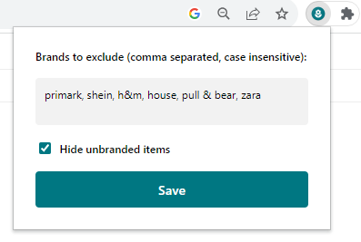

## Fast Fashion Begone
### Chrome extension for excluding selected brands from Vinted

This Chrome browser extension aims to filter out specified brands from Vinted in search results and the recommended items section.

  

#### Installation
1. [Download this repository](https://github.com/nonnullish/fast-fashion-begone/archive/refs/heads/main.zip) and unpack the downloaded `.zip` archive.
2. Go to `chrome://extensions/` in the browser URL bar and toggle the developer mode on.
3. Click “Load unpacked” and upload the unpacked folder.
4. Click on the extension button and specify the brands that you don't want to see.

#### Known issues
If Vinted changes its layout, this extension will likely break. In that case, please let me know by opening an issue in this repository.

#### Privacy
No data is sent or collected. When the page loads, the items get hidden. 
